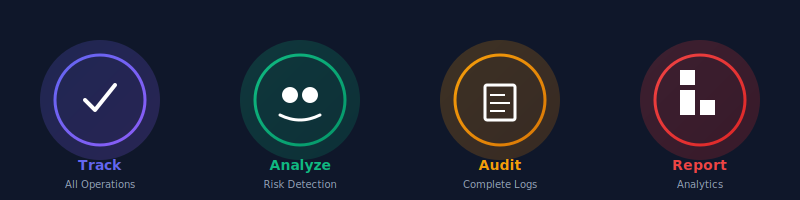
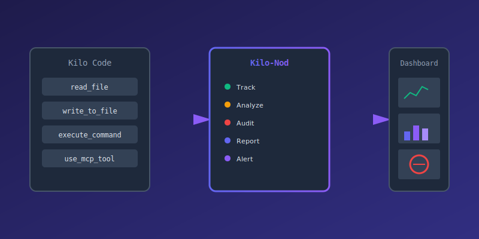
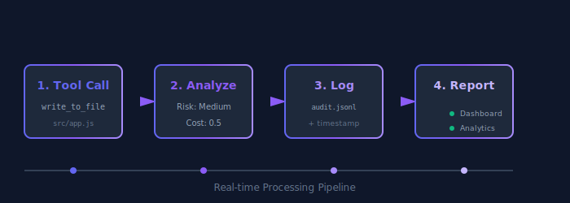
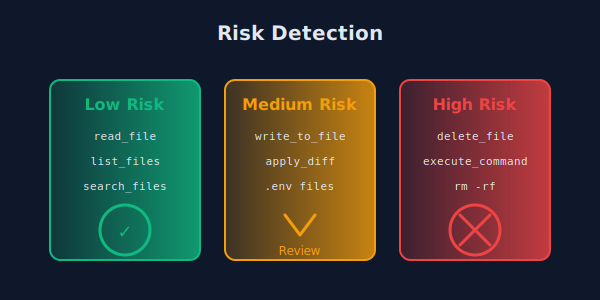
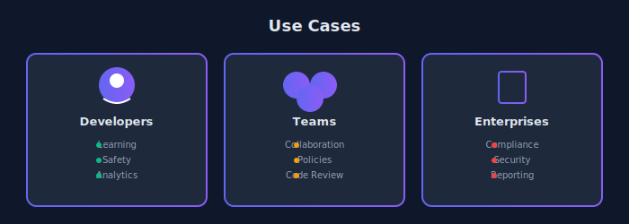

<div align="center">
  
  <br/>
  
  
  <p><strong>MCP-based permission management and audit logging for Kilo Code</strong></p>
  
  <p>
    <a href="#features">Features</a> •
    <a href="#installation">Installation</a> •
    <a href="#usage">Usage</a> •
    <a href="#architecture">Architecture</a> •
    <a href="#contributing">Contributing</a>
  </p>
</div>

---

## Overview

Kilo-Nod is a Model Context Protocol (MCP) server that provides comprehensive permission tracking, audit logging, and analytics for Kilo Code. It enables teams and enterprises to maintain visibility and control over AI-assisted coding operations while ensuring compliance and security.

### Problem Statement

While Kilo Code offers powerful auto-approve settings for streamlined workflows, organizations need:

- **Visibility** into AI tool usage across teams
- **Audit trails** for compliance and security
- **Risk analysis** for sensitive operations
- **Analytics** to understand AI coding patterns
- **Team policies** for consistent governance

### Solution

Kilo-Nod integrates directly with Kilo Code via MCP to provide:

- Real-time tracking of all tool calls
- Comprehensive audit logging
- Risk level detection and analysis
- Usage statistics and analytics
- Team collaboration features

## Features

<div align="center">
  
</div>

### Core Capabilities

**Permission Tracking**
- Monitors all Kilo Code tool calls (read_file, write_to_file, execute_command, etc.)
- Logs every action with timestamps and context
- Tracks approval/rejection decisions

**Risk Analysis**
- Automatically detects high-risk operations (delete, execute, etc.)
- Identifies sensitive file access (.env, credentials, config)
- Provides risk scoring (low, medium, high)

**Audit Logging**
- Persistent logs stored in ~/.kilo-nod/audit.jsonl
- Structured JSON format for easy parsing
- Session-based organization
- Complete history retention

**Analytics & Reporting**
- Tool usage frequency statistics
- Risk distribution analysis
- Cost estimation per tool
- Session summaries

### MCP Integration

<div align="center">
  
</div>

**Tools Provided**

```
track_permission    Log a Kilo Code tool call with risk analysis
start_session       Begin a new tracking session
end_session         End the current tracking session
get_stats           Retrieve usage statistics and analytics
```

**Resources Provided**

```
audit://logs/recent    Last 100 audit log entries
audit://logs/all       Complete audit history
audit://stats          Aggregated usage statistics
```

## Installation

### Prerequisites

- Node.js 18 or higher
- Kilo Code installed (VS Code extension or CLI)
- npm or pnpm package manager

### Setup

```bash
# Clone the repository
git clone https://github.com/Tasfia-17/kilonod.git
cd kilonod

# Install MCP server dependencies
cd mcp-server
npm install

# Start the MCP server
npm start
```

### Configure Kilo Code

Add the MCP server to your Kilo Code configuration:

**For VS Code Extension:**

Open VS Code settings (JSON) and add:

```json
{
  "kilocode.mcpServers": {
    "kilo-nod": {
      "command": "node",
      "args": ["/absolute/path/to/kilonod/mcp-server/index.js"]
    }
  }
}
```

**For Kilo CLI:**

Edit `~/.kilo/config.json`:

```json
{
  "mcpServers": {
    "kilo-nod": {
      "command": "node",
      "args": ["/absolute/path/to/kilonod/mcp-server/index.js"]
    }
  }
}
```

## Usage

### Basic Tracking

Once configured, Kilo-Nod automatically tracks all Kilo Code operations:

```javascript
// When Kilo Code executes a tool
await kilo.tools.write_to_file({
  path: "src/app.js",
  content: "console.log('Hello');"
});

// Kilo-Nod automatically logs:
// - Tool name: write_to_file
// - Parameters: {path, content}
// - Risk level: medium
// - Timestamp: 2026-02-20T15:59:49.993Z
```

### Session Management

Track related operations in sessions:

```javascript
// Start a session
await mcp.callTool('start_session', {
  name: 'Feature: User Authentication'
});

// ... perform Kilo Code operations ...

// End the session
await mcp.callTool('end_session', {});
```

### Viewing Audit Logs

Access logs via MCP resources:

```javascript
// Get recent logs
const recent = await mcp.readResource('audit://logs/recent');

// Get all logs
const all = await mcp.readResource('audit://logs/all');

// Get statistics
const stats = await mcp.readResource('audit://stats');
```

### Manual Tracking

Explicitly track operations:

```javascript
await mcp.callTool('track_permission', {
  tool: 'execute_command',
  params: {
    command: 'npm install axios'
  },
  approved: true
});
```

## Architecture

### System Design

<div align="center">
  
</div>

### Data Flow

<div align="center">
  
</div>

### Data Flow

1. **Tool Call**: Kilo Code executes a tool (e.g., write_to_file)
2. **Interception**: MCP protocol routes call through Kilo-Nod
3. **Analysis**: Risk detection and cost estimation
4. **Logging**: Append to audit log with timestamp
5. **Statistics**: Update aggregated statistics
6. **Response**: Return tracking confirmation

### Risk Detection Algorithm

<div align="center">
  
</div>

```javascript
function detectRisk(tool, params) {
  // High risk: destructive operations
  if (['delete_file', 'execute_command'].includes(tool)) {
    return 'high';
  }
  
  // Check for dangerous patterns
  const dangerous = ['rm -rf', 'sudo', 'chmod 777'];
  if (dangerous.some(p => JSON.stringify(params).includes(p))) {
    return 'high';
  }
  
  // Medium risk: write operations or sensitive files
  if (['write_to_file', 'apply_diff'].includes(tool)) {
    return 'medium';
  }
  
  const sensitive = ['.env', 'config', 'credentials'];
  if (sensitive.some(f => JSON.stringify(params).includes(f))) {
    return 'medium';
  }
  
  return 'low';
}
```

## Project Structure

```
kilonod/
├── mcp-server/              MCP server implementation
│   ├── index.js             Main server with MCP protocol
│   ├── package.json         Dependencies and scripts
│   ├── tools/               Tool implementations
│   ├── resources/           Resource handlers
│   └── lib/                 Utility functions
│
├── web/                     Web dashboard (optional)
│   ├── src/                 React components
│   │   ├── App.jsx          Main application
│   │   ├── components/      UI components
│   │   └── hooks/           Custom React hooks
│   ├── package.json         Frontend dependencies
│   └── vite.config.js       Build configuration
│
├── docs/                    Documentation
│   ├── API.md               API reference
│   ├── ARCHITECTURE.md      Architecture details
│   └── CONTRIBUTING.md      Contribution guidelines
│
├── config/                  Configuration templates
│   ├── policies.json        Permission policies
│   └── team.json            Team settings
│
├── logo.svg                 Project logo
├── banner.svg               Project banner
├── README.md                This file
└── LICENSE                  MIT License
```

## Configuration

### Permission Policies

Create custom policies in `config/policies.json`:

```json
{
  "policies": [
    {
      "name": "production-safe",
      "rules": [
        {
          "tool": "delete_file",
          "action": "require_approval",
          "condition": "always"
        },
        {
          "tool": "execute_command",
          "action": "block",
          "condition": "contains:rm -rf"
        }
      ]
    }
  ]
}
```

### Team Settings

Configure team-wide settings in `config/team.json`:

```json
{
  "team": {
    "name": "Engineering",
    "members": ["user1@example.com", "user2@example.com"],
    "defaultPolicy": "production-safe",
    "notifications": {
      "slack": "https://hooks.slack.com/services/YOUR/WEBHOOK/URL",
      "discord": "https://discord.com/api/webhooks/YOUR/WEBHOOK/URL"
    }
  }
}
```

## Use Cases

<div align="center">
  
</div>

### Individual Developers

**Learning and Visibility**
- Understand what Kilo Code does under the hood
- Learn AI coding patterns and best practices
- Track personal productivity metrics

**Safety and Control**
- Extra confirmation for risky operations
- Prevent accidental destructive actions
- Maintain audit trail for personal projects

### Development Teams

**Collaboration**
- Share permission policies across team
- Consistent governance for AI tool usage
- Team-wide visibility into AI operations

**Code Review**
- Audit trail for AI-generated changes
- Track who approved what operations
- Review AI coding patterns in retrospect

### Enterprises

**Compliance**
- Complete audit logs for regulatory requirements
- Demonstrate AI governance to auditors
- Track all AI-assisted code changes

**Security**
- Additional guardrails for production environments
- Risk analysis for sensitive operations
- Integration with existing security tools

**Reporting**
- Detailed analytics for management
- Cost tracking and optimization
- Team productivity insights

## API Reference

### MCP Tools

#### track_permission

Track a Kilo Code tool call with automatic risk analysis.

**Parameters:**
- `tool` (string, required): Name of the Kilo Code tool
- `params` (object, required): Tool parameters
- `approved` (boolean, optional): Whether action was approved (default: true)

**Returns:**
```json
{
  "tracked": true,
  "risk": "medium",
  "cost": 0.5,
  "totalCalls": 42
}
```

#### start_session

Begin a new tracking session for related operations.

**Parameters:**
- `name` (string, optional): Session name or description

**Returns:**
```json
{
  "sessionId": "session-1708444789993",
  "name": "Feature: User Authentication",
  "startTime": "2026-02-20T15:59:49.993Z"
}
```

#### end_session

End the current tracking session.

**Parameters:** None

**Returns:**
```json
{
  "ended": true,
  "sessionId": "session-1708444789993"
}
```

#### get_stats

Retrieve usage statistics and analytics.

**Parameters:**
- `period` (string, optional): Time period ('today', 'week', 'month', 'all')

**Returns:**
```json
{
  "totalCalls": 156,
  "byTool": {
    "read_file": 45,
    "write_to_file": 32,
    "execute_command": 12
  },
  "byRisk": {
    "low": 89,
    "medium": 54,
    "high": 13
  },
  "sessions": [...]
}
```

### MCP Resources

#### audit://logs/recent

Last 100 audit log entries in JSON format.

#### audit://logs/all

Complete audit history in JSON format.

#### audit://stats

Aggregated usage statistics in JSON format.

## Development

### Setup Development Environment

```bash
# Clone repository
git clone https://github.com/Tasfia-17/kilonod.git
cd kilonod

# Install dependencies
cd mcp-server && npm install
cd ../web && npm install

# Run tests
npm test

# Start development server
npm run dev
```

### Running Tests

```bash
# Unit tests
npm test

# Integration tests
npm run test:integration

# Coverage report
npm run test:coverage
```

### Code Style

This project follows standard JavaScript conventions:

- ES modules (import/export)
- 2-space indentation
- Semicolons required
- Single quotes for strings
- Trailing commas in objects/arrays

## Contributing

We welcome contributions from the community. Please read our contributing guidelines before submitting pull requests.

### How to Contribute

1. Fork the repository
2. Create a feature branch (`git checkout -b feature/amazing-feature`)
3. Commit your changes (`git commit -m 'Add amazing feature'`)
4. Push to the branch (`git push origin feature/amazing-feature`)
5. Open a Pull Request

### Development Guidelines

- Write clear, descriptive commit messages
- Add tests for new features
- Update documentation as needed
- Follow existing code style
- Ensure all tests pass before submitting

### Reporting Issues

- Use GitHub Issues for bug reports and feature requests
- Provide detailed reproduction steps for bugs
- Include system information (OS, Node version, Kilo Code version)

## License

This project is licensed under the MIT License. See the [LICENSE](LICENSE) file for details.

---

<div align="center">
  <p>Made with care for the Kilo Code community</p>
  <p>Copyright 2026 Kilo-Nod Contributors</p>
</div>
